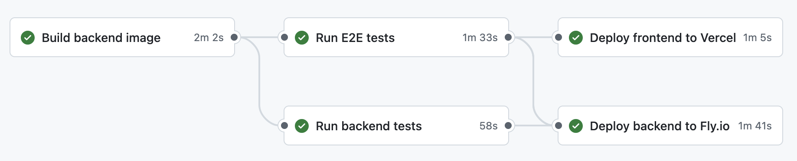

# Testing guide

This document covers all aspects of testing in the DAM project: backend unit tests, end-to-end tests, and CI/CD
pipelines.

## Overview

The project has three levels of testing:

1. **Backend unit tests** - PHPUnit tests for Laravel API logic
2. **End-to-end tests** - Playwright tests for full user workflows
3. **CI/CD pipeline** - Automated testing and deployment on every push

## Backend tests (PHPUnit)

### Running tests

Backend tests always run inside the Docker container to ensure consistent environment.

```bash
# Start backend services
docker compose up -d

# Run all backend tests
docker compose exec backend composer test

# Or use just command (runs composer test in container)
just test

# Run specific test file
docker compose exec backend vendor/bin/phpunit tests/Feature/GraphQL/AuthTest.php

# Run with verbose output
docker compose exec backend composer test -- --verbose
```

### Test structure

Backend tests are organized in `backend/tests/`:
- `Feature/` - Integration tests for GraphQL API endpoints

Tests use a dedicated PostgreSQL test database (`db_test` container) with in-memory `tmpfs` storage for speed.

## End-to-end tests (Playwright)

E2E tests validate the entire application flow from the user's perspective, including authentication, navigation, and
CRUD operations.

### Running E2E tests locally

**Prerequisites**: Backend services must be running.

```bash
# Start backend services
docker compose up -d

# Run E2E tests
cd frontend && npx playwright test

# Run with UI mode for debugging
cd frontend && npx playwright test --ui

# Run specific test file
cd frontend && npx playwright test tests/auth.spec.ts
```

**Convenience command**: `just e2e` starts backend services and runs E2E tests in one command.

### Test structure

E2E tests are in `frontend/tests/`:
- `auth.spec.ts` - Authentication flows (register, login, logout)
- More test files to be added...

### Writing E2E tests

Use `data-testid` attributes for reliable element selection:

```tsx
// In component
<button data-testid="login-button">Log in</button>

// In test
await page.getByTestId('login-button').click();
```

**Best practices**:
- Use `crypto.randomUUID()` for unique test data (emails, names)
- Clean up test data by using unique identifiers per test run
- Wait for actual API responses, not arbitrary timeouts
- Test user workflows, not implementation details

## CI/CD pipeline

The project uses GitHub Actions for continuous integration and deployment.



### Pipeline overview

**Workflow file**: `.github/workflows/ci.yml`

**Triggers**:
- Pushes to `main` branch
- Pull requests to any branch
- Skip CI by including `[skip ci]` in commit message body (useful for documentation-only changes)

**Jobs**:
1. **Build backend** - Build Docker image and save as artifact
2. **Backend tests** - Run PHPUnit tests with PostgreSQL
3. **E2E tests** - Run Playwright against production build
4. **Deploy backend** - Deploy to Fly.io (main branch only, after tests pass)
5. **Deploy frontend** - Deploy to Vercel (main branch only, after tests pass)

### Testing the CI pipeline locally

Use [`act`](https://github.com/nektos/act) to run GitHub Actions workflows locally:

```bash
# Install act
brew install act  # macOS
# or: https://github.com/nektos/act#installation

# Run the entire CI workflow
act push

# Run specific job
act -j build-backend
act -j backend-tests
act -j e2e-tests

# Run with specific event
act pull_request
```

**Configuration**: The `.actrc` file configures act for local testing:
- Uses linux/amd64 platform for M1/M2 Mac compatibility
- Uses appropriate runner images

**Note**: Stop local `docker-compose` services before running `act` to avoid port conflicts.

### CI environment

The CI pipeline uses Docker Compose with:
- `docker-compose.ci.yml` - Base CI configuration (backend + database)
- `docker-compose.e2e.yml` - E2E test overlay (adds frontend container)

Key differences from local development:
- Uses pre-built Docker images (no build context)
- Uses `tmpfs` for database (faster, ephemeral)
- No port mappings (avoids conflicts in parallel jobs)

### Deployment

Deployments only happen on successful pushes to `main`:

**Backend (Fly.io)**:
1. Download tested Docker image artifact
2. Load into Docker
3. Deploy using `flyctl deploy --local-only`

**Frontend (Vercel)**:
1. Vercel builds and deploys via GitHub Action
2. Uses project settings for build configuration
3. Deploys after E2E tests pass

Both deployments include GitHub deployment tracking for visibility in PRs and the deployments page.

## Debugging test failures

### Backend test failures

```bash
# Run tests with verbose output
cd backend && vendor/bin/phpunit --verbose

# Run specific test
cd backend && vendor/bin/phpunit --filter testUserCanRegister
```

Check Laravel logs:
```bash
docker compose exec backend tail -f storage/logs/laravel.log
```

Use Telescope for request inspection:
- http://localhost:8000/telescope

### E2E test failures

Playwright automatically captures:
- Screenshots on failure
- Video recordings
- Trace files (on retry)

View test reports:
```bash
cd frontend && npx playwright show-report
```

Debug interactively:
```bash
cd frontend && npx playwright test --debug
```

### CI failures

1. Check the Actions tab on GitHub for detailed logs
2. Download artifacts (test reports, screenshots) from failed runs
3. Reproduce locally with `act` before pushing fixes
4. Check Fly.io or Vercel deployment logs if deploy fails

## Test coverage

Current test coverage:

**Backend**:
- ✅ User registration
- ✅ User login
- 🚧 Image upload (planned)
- 🚧 Image metadata updates (planned)

**Frontend (E2E)**:
- ✅ Unauthenticated redirect
- ✅ User registration flow
- ✅ Login with existing credentials
- ✅ Logout flow
- 🚧 Image upload (planned)
- 🚧 Image gallery navigation (planned)
- 🚧 Settings management (planned)

## Performance

**Backend tests**: ~5-10 seconds (PostgreSQL with `tmpfs`)

**E2E tests**: ~30-45 seconds (includes build + preview server startup)

**Full CI pipeline**: ~3-5 minutes (parallel jobs)

## Resources

- [PHPUnit Documentation](https://phpunit.de/documentation.html)
- [Playwright Documentation](https://playwright.dev/)
- [GitHub Actions Documentation](https://docs.github.com/en/actions)
- [act Documentation](https://github.com/nektos/act)
